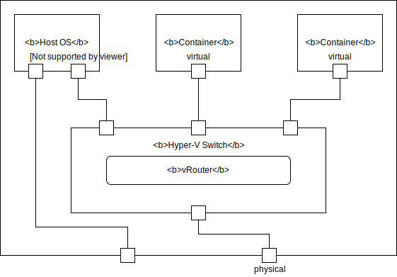

# Packet flow

## Hyper-V Switch connections structure

The diagram below shows connections between a host and two containers
with vRouter extension loaded to Hyper-V Switch. All interfaces
(vhost, virtual, physical) are connected to the Hyper-V Switch
and all packets are handled by vRouter.

## Packet processing

1. Packets are sent from the host OS to vhost interface, from container to the
virtual interface, or received on physical interface.

1. Packets are processed by NDIS and vRouter's
[`FilterSendNetBufferLists`](https://docs.microsoft.com/en-us/windows-hardware/drivers/ddi/content/ndis/nc-ndis-filter_send_net_buffer_lists)
function is called. It receives a list of [`NBLs`](https://docs.microsoft.com/en-us/windows-hardware/drivers/network/net-buffer-list-structure)
(a list of lists of packets, see more [here](/For developers/Supplementary knowledge/NBL_processing)).

1. If the switch is not running,
[`NdisFSendNetBufferListsComplete`](https://docs.microsoft.com/en-us/windows-hardware/drivers/ddi/content/ndis/nf-ndis-ndisfsendnetbufferlistscomplete)
function is caled and all packets are dropped.

1. `NBL` list is split into two lists: one that will be processed by vRouter
and second, that requires
[native forwarding](https://docs.microsoft.com/en-us/windows-hardware/drivers/network/hybrid-forwarding)
and will be forwarded by Hyper-V Switch.

1. Natively-forwarded `NBLs` are passed to NDIS using
[`NdisFSendNetBufferLists`](https://docs.microsoft.com/en-us/windows-hardware/drivers/ddi/content/ndis/nf-ndis-ndisfsendnetbufferlists)
function.

1. `NBL` list is split into separate `NBLs`.

1. If there are no VIFs yet, packets are processed using simple switch logic
without using of vRouter logic: they are sent to correct port using
[`NdisFSendNetBufferLists`](https://docs.microsoft.com/en-us/windows-hardware/drivers/ddi/content/ndis/nf-ndis-ndisfsendnetbufferlists)
function.

1. Every `NBL` may contain multiple packets (`NBs`).
It is represented as a `WIN_MULTI_PACKET` - an NDIS-independent wrapper.
The system independent dp-core code handles single packet at a time, so
`WIN_MULTI_PACKET` is converted to `PWIN_PACKET_LIST` - a list of `WIN_PACKET`
structures which are wrappera around `NBL` containing single `NB`.
For more information about wrappers, please see
[Windows structures abstraction](/For developers/Structure#windows-structures-abstraction).

1. For every `WIN_PACKET`, a `VR_PACKET_WRAPPER` structure is alocated.
It contains a `vr_packet` structure - a packet representation used in dp-core,
which is linked in underlying `NBL`.

1. The dp-core code requires that all packet headers are in a continuous
memory region. On Windows, each `NB` contains a list of `MDLs` which describes
multiple memory regions. To avaid a situation when the headers are in different
memory regions, new NBL containing continuous memory region is allocated
and all data is copied there.

1. The packet is sent to dp-core using `vif_rx` function for selected `vif`.

1. After processing the packet by dp-core, the `win_if_tx` function is called.
The checksums are recalculated or offloaded - depending on checksum type and
offload capabilities of the hardware - and the packet if split if it
is too large (it is segmented - for TCP packets, or fragmented - for non-TCP
packets). After this process the resulting packets are represented
as `WIN_MULTI_PACKET`.

1. The destination port for the packets is selected basing on the `vif`.
The packet is passed to NDIS using `NdisFSendNetBufferLists` function.

1. After processing the packet by all layers of drivers, NDIS calls
[`FilterSendNetBufferListsComplete`](https://docs.microsoft.com/en-us/windows-hardware/drivers/ddi/content/ndis/nc-ndis-filter_send_net_buffer_lists_complete)
function. vRouter frees all allocated packets and completes
packets allocated by upper-layer drivers.
