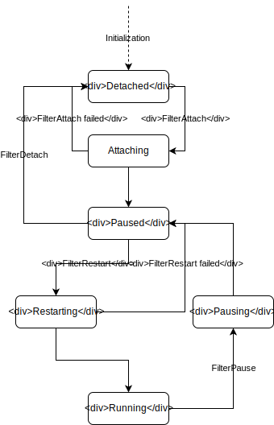

# Structure of vRouter code on Windows

This document describes general structure of vRouter code and implementation
details of the most important features including dp-core callbacks, driver
lifecycle, packet flow, communication channels and structures abstractions.

## vRouter structure overview

The vRouter module on Windows is implemented as NDIS modifying filter driver:
the Hyper-V Extensible Switch forwarding extension
(see [NDIS types overview](../Supplementary knowledge/NDIS_driver_types_overview)
for more details on NDIS driver types).

The implementation consists of:

* OS-independent, generic `dp-core` directory, where the main logic of packet
processing is placed,
* header files in `include` directory,
* Windows specific code, including dp-core callback in `windows` directory;
All OS-dependent callcacks required by dp-core are can be found in
`vr_host.c` and `vr_host_interface.c` files,
* userspace applications used to read and modify the state of vRouter
placed in `utils` directory,
* unit tests that can be run in userspace, in `test`.

## Driver lifecycle

### Loading the driver

When the driver implementing vRouter logic is loaded, the first function
called by the system is a
[`DriverEntry`](https://docs.microsoft.com/en-us/windows-hardware/drivers/ddi/content/wdm/nc-wdm-driver_initialize)
routine, which is responsible for two main things:

* setting up the pointer to
[`DriverUnload`](https://docs.microsoft.com/en-us/windows-hardware/drivers/ddi/content/wdm/nc-wdm-driver_unload)
routine which will be called when the driver is unloaded. For more information,
see [Unloading the driver](#unloading-the-driver),

* calling the
[`NdisFRegisterFilterDriver`](https://docs.microsoft.com/en-us/windows-hardware/drivers/ddi/content/ndis/nf-ndis-ndisfregisterfilterdriver)
function with a pointer to structure containing driver characteristic which
consists of driver names, versions and, the most important, functions called
by the system on speciffic conditions.
vRouter implements the following sets of functions:

    * [`FilterAttach`](https://docs.microsoft.com/en-us/windows-hardware/drivers/ddi/content/ndis/nc-ndis-filter_attach),
    [`FilterDetach`](https://docs.microsoft.com/en-us/windows-hardware/drivers/ddi/content/ndis/nc-ndis-filter_detach),
    [`FilterPause`](https://docs.microsoft.com/en-us/windows-hardware/drivers/ddi/content/ndis/nc-ndis-filter_pause),
    [`FilterRestart`](https://docs.microsoft.com/en-us/windows-hardware/drivers/ddi/content/ndis/nc-ndis-filter_restart):
    see more in the [Driver states](#driver-states) section,

    * [`FilterSendNetBufferLists`](https://docs.microsoft.com/en-us/windows-hardware/drivers/ddi/content/ndis/nc-ndis-filter_send_net_buffer_lists),
    [`FilterSendNetBufferListsComplete`](https://docs.microsoft.com/en-us/windows-hardware/drivers/ddi/content/ndis/nc-ndis-filter_send_net_buffer_lists_complete):
    not related to the driver lifecycle, described more precisely in the
    [Packet flow](#packet-flow) section,

    * [`FilterOidRequest`](https://docs.microsoft.com/en-us/windows-hardware/drivers/ddi/content/ndis/nc-ndis-filter_oid_request),
    [`FilterOidRequestComplete`](https://docs.microsoft.com/en-us/windows-hardware/drivers/ddi/content/ndis/nc-ndis-filter_oid_request_complete),
    [`FilterCancelOidRequest`](https://docs.microsoft.com/en-us/windows-hardware/drivers/ddi/content/ndis/nc-ndis-filter_cancel_oid_request):
    see [Switch parameters and events](#switch-parameters-and-events) section,

    * [`FilterNetPnpEvent`](https://docs.microsoft.com/en-us/windows-hardware/drivers/ddi/content/ndis/nc-ndis-filter_net_pnp_event):
    see [Plug and Play and Power Management events](#plug-and-play-and-power-management-events) section.

### Driver states

Filter driver can be in multiple different states.
The relationship between them is shown in the diagram below:

After loading by operating system, the driver is in *Detached* state:
it is detached from the network driver stack. When NDIS calls the
[`FilterAttach`](https://docs.microsoft.com/en-us/windows-hardware/drivers/ddi/content/ndis/nc-ndis-filter_attach)
function, the driver enters *Attaching* state. If the operation is successful,
the driver enters the *Paused* state. Otherwise, it returns to *Detached* state.
The main things done in vRouter's `FilterAttach` function are:

* allocating switch object containing filter handle,
pointers to optional switch handlers and switch context,
* initializing read/write locks, NBL pool and NB pool,
* initializing ksync, pkt0 and shmem devices, sandesh transport,
vRouter logic and fragment assembler,
* initializing packet dumping functionality,
* setting global variable containing number of CPUs.

When vRouter is in the *Paused* state, it does not perform any network
I/O operations. When NDIS calls
[`FilterRestart`](https://docs.microsoft.com/en-us/windows-hardware/drivers/ddi/content/ndis/nc-ndis-filter_restart)
function in this state, the driver enters *Restarting* state, and after this
operation is complete, it enters the *Running* state.
When restarting operation fails, the driver returns to *Paused* state.
When NDIS calls
[`FilterDetach`](https://docs.microsoft.com/en-us/windows-hardware/drivers/ddi/content/ndis/nc-ndis-filter_detach)
in the *Paused* state, the driver enters *Detached* state and is detached
from the network driver stack.

The main responsibility of vRouter's `FilterRestart` function is handling
a scenario when there are no VIFs by implementing single switch logic.
`FilterDetach` waits for all pending OIDs, stops and uninitializes
fragment assembler, vRouter logic, sandesh transport and ksync,
pkt0 and shmem devices. It also destroys NBL and NB pools and frees all locks.

When vRouter is in *Running* state, it can perform all network I/O operations.
The driver enters *Pausing* state when NDIS calls
[`FilterPause`](https://docs.microsoft.com/en-us/windows-hardware/drivers/ddi/content/ndis/nc-ndis-filter_pause)
function. In *FilterPause* the driver should wait for all pending network
I/O operations and all pending [OID requests](#switch-parameters-and-events).
After that it enters *Paused* state.

### Switch parameters and events

The [`FilterOidRequest`](https://docs.microsoft.com/en-us/windows-hardware/drivers/ddi/content/ndis/nc-ndis-filter_oid_request),
[`FilterOidRequestComplete`](https://docs.microsoft.com/en-us/windows-hardware/drivers/ddi/content/ndis/nc-ndis-filter_oid_request_complete)
and
[`FilterCancelOidRequest`](https://docs.microsoft.com/en-us/windows-hardware/drivers/ddi/content/ndis/nc-ndis-filter_cancel_oid_request)
functions are used for handling, processing, filtering and issuing
OID (Object Identifier) requests by the NDIS filter driver.
The adapter parameters described by OID values includes device characteristics,
statistics and configurable settings.
vRouter uses the following set of OID requests:

* `OID_SWITCH_NIC_CONNECT` - for implementing simple switch logic when there
are no VIFs in vRouter. This request is issued to notify switch extensions
about completely established network connection between extensible
switch port and a network adapter.
* `OID_SWITCH_PARAMETERS` - vRouter sends this query and implements synchronous
waiting routine which waits for response containing configuration
data of the extensible switch. It is used for checking if the switch is active.
* `OID_SWITCH_NIC_ARRAY` - used by vRouter for obtaining an array
of configuration parameters of all network adapters
associated with extensible switch port.

### Plug and Play and Power Management events

The [`FilterNetPnpEvent`](https://docs.microsoft.com/en-us/windows-hardware/drivers/ddi/content/ndis/nc-ndis-filter_net_pnp_event)
function is called by NDIS to notify the filter driver about network
Plug and Play and Power Management events that was issued for underlying NIC.
vRouter handles activation of the switch in this function.

### Unloading the driver

TODO: DriverUnload

## Packet flow

TODO: Link to separate document (link to NBL description inside)

## Communication channels

TODO: ksync, pkt0, pipes, shmem

## Windows structures abstraction

TODO: WinPakcet, WinPacketRaw, VrPacket, ...
