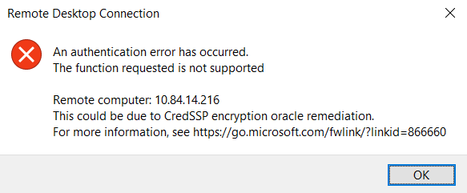
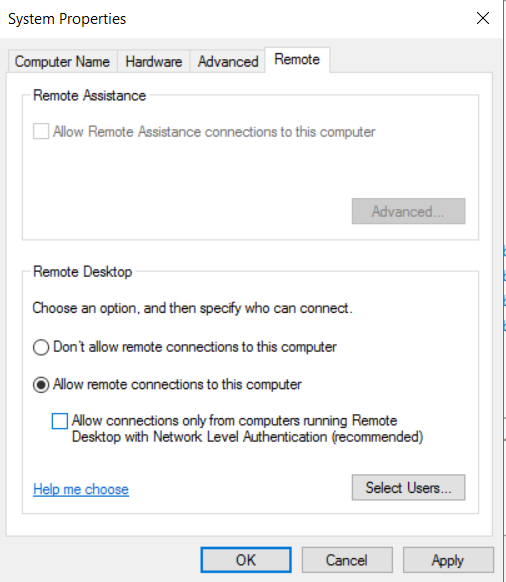
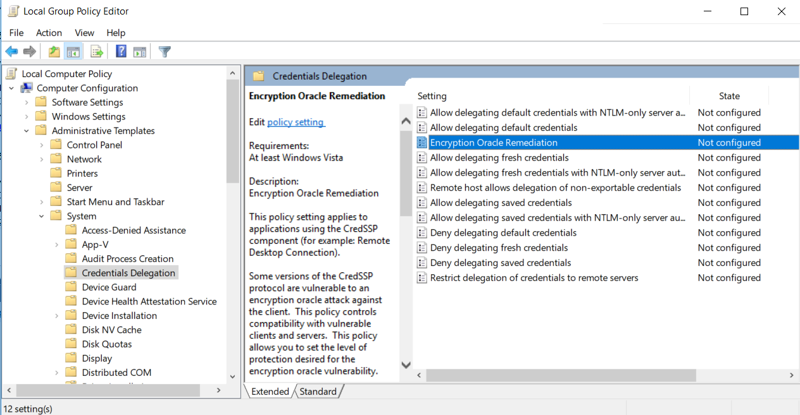
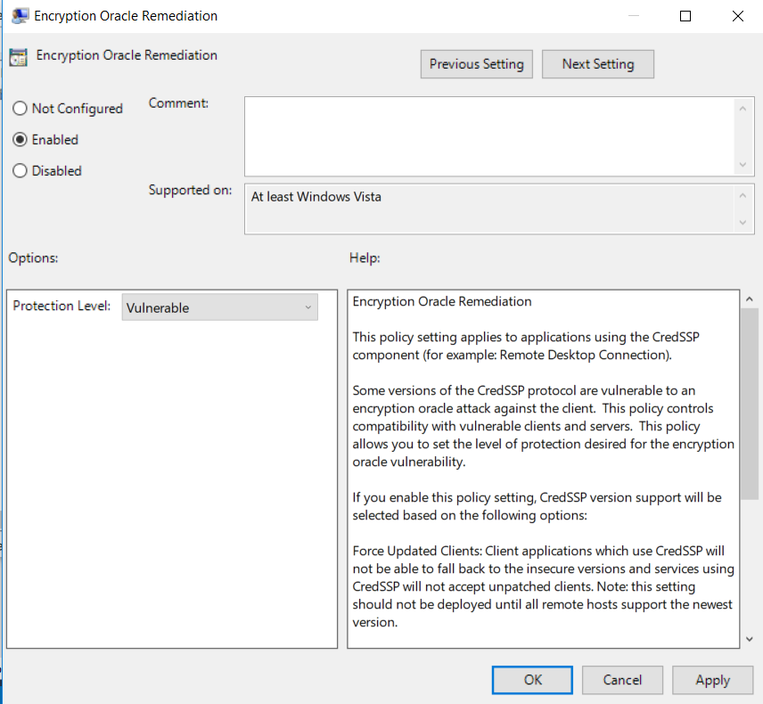

# I get authentication error "CredSSP encryption Oracle remediation" when trying to RDP into a Windows machine from another Windows machine

If you see the above error, please try the following two options:

In this document the windows machine from where you are trying the RDP is called "client" and the
windows 2016 machine you are trying an RDP into is called a "server".

## Changing the options in the server itself:

warning: Please note that this makes the server vulnerable.

This is the safer option as it does not make the client vulnerable.
On the Server, please start Server Manager.Go to Local Server and click on Remote Desktop.
Make sure that the checkbox that says "allow connections only from computers running remote desktop with Network Level Authentication" is not checked.

## Changing the options on the client:

Warning: Please note that this makes the client vulnerable.
On the client machine,
1.run gpedit.msc
2.Go to the "Encryption oracle remediation" option as shown in the image below.

3.Set the "enabled" option and make the protection level "Vulnerable" as shown below.
