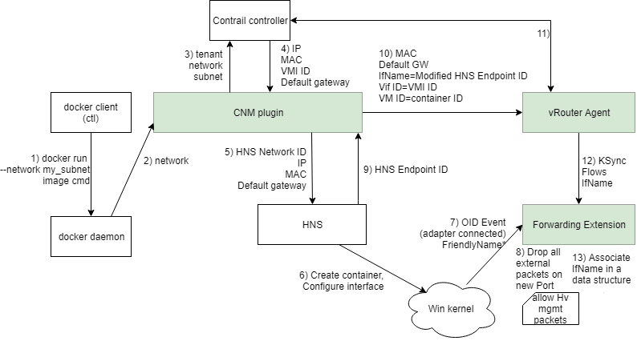
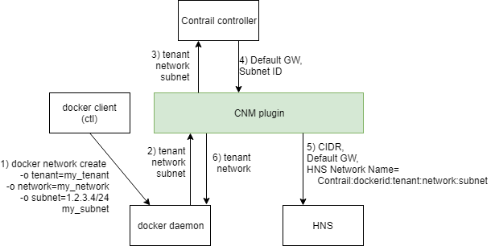

# CNM Plugin

## The purpose

Windows CNM plugin for Docker is a Windows specific component. It coordinates all activities related to container creation and docker network creation.

It is roughly equivalent to Nova Agent, but runs as a Windows service and implements docker driver APIs. It communicates with config, Agent and HNS (Host Network Service - Windows container management service).

It is written in Golang.
Git repository with the source code is available [here](https://review.opencontrail.org/Juniper/contrail-windows-docker-driver
).

## Container creation lifecycle

1. Docker client tells docker daemon to run a container and attach it to a Docker network (that corresponds to a chunk of a Contrail subnet).
1. Docker deamon delegates the network configuration of the container that is being created to the CNM plugin. CNM plugin queries docker daemon about metadata associated with docker's network resource and receives Contrail tenant name and subnet CIDR.
1. CNM plugin performs a series of queries against Contrail Controller that create various Contrail resources, most notably: virtual-machine, virtual-machine-interface, instance-ip.
1. CNM plugin receives Instance IP, MAC and default gateway to configure the newly created container's interface with. It also receives UUID of virtual-machine-interface resource
1. CNM plugin knows all the information necessary to recreate HNS Network's name. It uses this name to identify which HNS network to attach the container to. CNM plugin sends requests to HNS to configure endpoint with newly received IP, MAC and Default gateway.
1. In the background, HNS creates the network compartment for the container and configures its interface.
1. The moment the interface is created, the Forwarding Extension receives an event about new adapter being connected. 
1. Forwarding Extension doesn't know what to do with it yet, so it stores it in a hash map, where the key is adapters FriendlyName. Then it waits, dropping all packets except the ones sent from native Hyper-V driver.
1. Meanwhile, if container creation was successful, HNS returns ID of the endpoint to CNM plugin.
1. CNM plugin sends "add port" request to vRouter Agent, with all the necessary information to identify the port both in Contrail terms (UUID of virtual-machine-interface) as well as in Windows terms (using Endpoint ID, which is a part of FriendlyName).
1. vRouter Agent communicates with Contrail Controller to let it know about newly added port.
1. vRouter Agent inserts basic rules and flows into the Forwarding Extension. 
1. Forwarding Extension uses the FriendlyName to determine which port seen in userspace corresponds to port waiting in Forwarding Extension's hash map.

    TODO: steps 11+ require a review as the hashmap has been removed and agent can inject vifs before interface is attached to vswitch.

## Network creation lifecycle

There is a slight discrepancy between Docker's and Contrail's networking model. Contrail can implement a logical, overlay network for containers. However, docker can only create a network locally, on the hypervisor.

This means that "docker network create" command needs to be ran on each hypervisor that will contain any container that could be connected to a specific network. In other words, "local" networks must be prepared on each host.

Furthermore, Docker's "network" is actually equivalent to Contrail's "subnet". This means, that during docker network creation, specific Contrail subnet (using CIDR notation) must be specified as a parameter.

1. Docker client tells docker daemon to create a docker network that will represent a chunk of a Contrail subnet. Tenant name, network name and subnet's CIDR are passed as parameters.
1. Docker daemon creates a network resource in its own, local database, and then delegates handling of network configuration to the CNM plugin.
1. CNM plugin queries Contrail Controller whether specified tenant, network and subnet combination exists. It also asks for their details.
1. Contrail Controller returns subnet's default gateway address as well as subnet's UUID
1. CNM plugin calls HNS function to create a HNS network with subnet's CIDR and default gateway address. It also sets the HNS network's name as a concatenation of "Contrail" with tenant name, network name and subnet ID.
1. CNM plugin tells docker daemon to store tenant and network names in docker network's metadata. Docker daemon stores this information in its own, local database.
