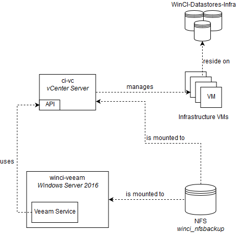

Infrastructure backups
======================

This document describes current backup system configuration for Contrail Windows CI.

**Table of contents**

- [Current backup setup](#current-backup-setup)
- [VM recovery guide](#vm-recovery-guide)
- [Backup scripts update guide](#backup-scripts-update-guide)

## Current backup setup

Diagram below presents an overview of current backup setup for Contrail Windows CI.



- Contrail Windows CI underlying infrastructure is based VMware vSphere
- Services support Contrail Windows CI are running on a set of _Infrastructure VMs_
- Infrastructure VMs reside on `WinCI-Datastores-Infra` datastore cluster
- WinCI-Datastores-Infra datastore cluster consists of an independent set of SSD-based datastores
    - independent, meaning these datastores are used solely for Infrastructure VMs
- Backups are performed using Veeam Backup & Replication software
    - Veeam Backup Free Edition is used
- Veeam is installed on `winci-veeam`, Windows Server 2016 virtual machine
- `winci-veeam` has a mounted NFS share `winci_nfsbackup` which is used as a backups repository
- Veeam connects to vSphere cluster using vSphere API
- Veeam performs full VM backups (using VeeamZIP feature in the Free edition)

Backups are performed regulary using _Windows Scheduled Tasks_.
Currently scheduled task runs every day, at 10 PM PST.
Scheduled task executes a PowerShell Script `Backup.ps1` located in `C:\BackupScripts\` directory.

Backup procedure looks as follows:

- Backups are performed by a set of PowerShell scripts
    - Scripts are located in `backups/` directory in [contrail-windows-ci](https://github.com/Juniper/contrail-windows-ci) repository
- `Backup.ps1` script performs the following steps:
    - Prunes backups by removing all but last _N_ backups
        - _N_ is configurable in the script
    - Uses VeeamZIP PowerShell cmdlets to perform a full backups of VMs listed in `Backup.ps1` file
- If an error occurs for any of the VMs listed, script continues its job. After performing backups for other VMs it terminates with an exception
- Each full backup is stored in a separate directory, located in `\\winci_nfsbackups\Backups\` directory on backup NFS share

## VM recovery guide

Current backup setup supports only full VM recovery. It needs to be performed, e.g. when:

- in case of underlying infrastructure hardware failure (e.g. corrupted disk, ESXi host failure)
- in case of bricking an operating system/virtual machine
- recovery of VM state from a certain point in time is desirable

Prerequisites to backup scripts updating:

- Windows 10/Windows Server 2016 machine to perform the steps
- Credentials to `winci-veeam` server
    - Please contact Windows CI team

To recover a VM from backup perform the following steps:

1. Establish a RDP connection `winci-veeam` server
1. Open `Veeam Backup & Replication Console`
    - program is available through Start menu
1. Veeam login window should open up
    - ensure that `localhost` and port `9392` are selected and `Use Windows session authentication` option is selected
    - click `Connect`
1. In the upper left corner click an option `Restore`
    - `Select backup file to restore` windows should open up
    - Click `browse`
    - In the address bar type in `X:\Backups\`
    - A list of directories named with date timestamps should show up
    - Select a directory with a date, matching your desired restore point
    - Enter this directory
    - Select a backup file (file with `.vbk` extension) which has prefix matching VM to be restored
    - Click `Open`
1. Progress bar named `Reading the backup file, please wait...` should show up
1. When a table named `Contained VMs` appears, select a VM to be restored, click `Restore`; clicking `Restore` opens up contextual menu; click option `Entire VM (including registration)`
1. After a few moments a restore wizard should show up
1. In `Virtual machine` section
    - From a table `Virtual machines to restore` select a VM to be restored
    - Click `Next`
1. In `Restore Mode` section
    - Select `Restore to the original location` option
    - Make sure `Restore VM tags` option is checked
    - Make sure `Quick rollback` option is unchecked
    - Click `Next`
1. In `Reason` section
    - Enter a reason for VM restoring into `Restore reasons` textbox
    - Click `Next`
1. In `Summary` section
    - Verify VM details presented in `Summary` textbox
    - Check `Power on target virtual machine` option if you want the restored VM to power on after restoration is completed
    - Click `Finish`
1. `VM Restore` window with progress report should appear
    - Window can be closed by clicking `Close` button, this will not stop the restore procedure
1. To open up `VM Restore` window again
    - Click `History` button in the lower left corner of Veeam Console
    - In the tree (in the left middle part of the Veeam Console) select `Restore > Full VM Restore` branch
    - A list of restore jobs should appear in the middle
    - Double-click a job corresponding to a VM you are currently restoring
    - `VM Restore` window should open up again
1. When a restore job finishes, verify if all services provided by the machine are up and working

## Backup scripts update guide

Backup scripts need to be updated, e.g. when:

- A list of VMs requiring backup changes
- A bug was fixed in the backup scripts

Prerequisites to backup scripts updating:

- Windows 10/Windows Server 2016 machine to perform the steps
- Credentials to `winci-veeam` server
    - Please contact Windows CI team

To update backup scripts perform the following steps:

1. Clone `contrail-windows-ci` repository and enter `backups/` directory

    ```powershell
    PS C:\Users\user> git clone https://github.com/Juniper/contrail-windows-ci.git
    PS C:\Users\user> cd contrail-windows-ci\backups
    PS C:\Users\user\contrail-windows-ci\backups>
    ```

1. Establish a PowerShell session with `winci-veeam` server

    ```powershell
    PS C:\Users\user\contrail-windows-ci\backups> $session = New-PSSession -ComputerName 10.84.12.29 -Credentials $(Get-Credential)
    ```

1. Copy `backups` directory's contents to `winci-veeam` server, to `C:\BackupScripts` directory

    ```powershell
    PS C:\Users\user\contrail-windows-ci\backups> Copy-Item .\* C:\BackupScripts -ToSession $session
    ```

1. Close PowerShell session

    ```powershell
    PS C:\Users\user\contrail-windows-ci\backups> Remove-PSSession $session
    ```
